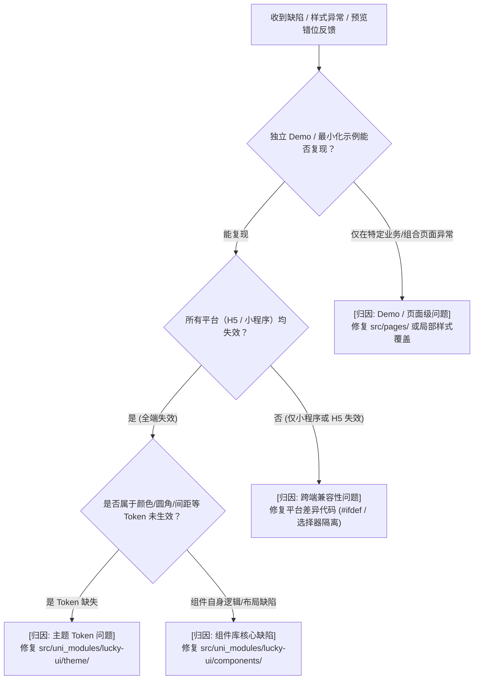

# Lucky UI 问题归因与分流诊断指南

本技能落实 **Lucky UI Fix Diagnosis Rule**，确保在开始任何代码修改前，明确问题归因与修改边界。

---

## 一、 归因判定决策树

---

## 二、 归因分类与修改边界

| 归因类型 | 典型特征 | 修改目标目录 | 禁忌原则 |
| :--- | :--- | :--- | :--- |
| **组件库核心缺陷** | Props 失效、默认盒模型错误、Flex/Grid 布局坍塌、事件未触发 | `src/uni_modules/lucky-ui/components/` | 严禁编写只对某个特定业务场景生效的特化逻辑 |
| **跨端兼容问题** | 小程序样式隔离导致选择器未穿透、原生组件遮挡、生命周期差异 | `src/uni_modules/lucky-ui/` 跨端兼容层 | 避免在 H5 端引入小程序特有 Polyfill 代码 |
| **主题 Token 缺失** | CSS 变量未定义、暗黑模式未适配、默认字号不合规 | `src/uni_modules/lucky-ui/theme/` | 不得在组件内硬编码十六进制颜色值 |
| **Demo 页面问题** | 页面外层容器未设高度导致百分比失效、Demo 数据未传、局部样式覆盖冲突 | `src/pages/` 对应页面 | **严禁为了掩盖 Demo 布局问题，往组件库根节点增加业务兜底 `!important` 样式** |

---

## 三、 诊断输出格式要求

在开始修复前，AI 必须在回复或计划中输出 1~2 句话的简要归因说明：

> **归因结论**：[组件库核心 / Demo 页面 / 跨端兼容 / 主题 Token]
> **判断依据**：经检查，在独立基础示例下该属性亦未生效，确定为 `lk-xxx` 组件内部 `computed` 未监听 props 变化导致，将在组件库源码内修复。
