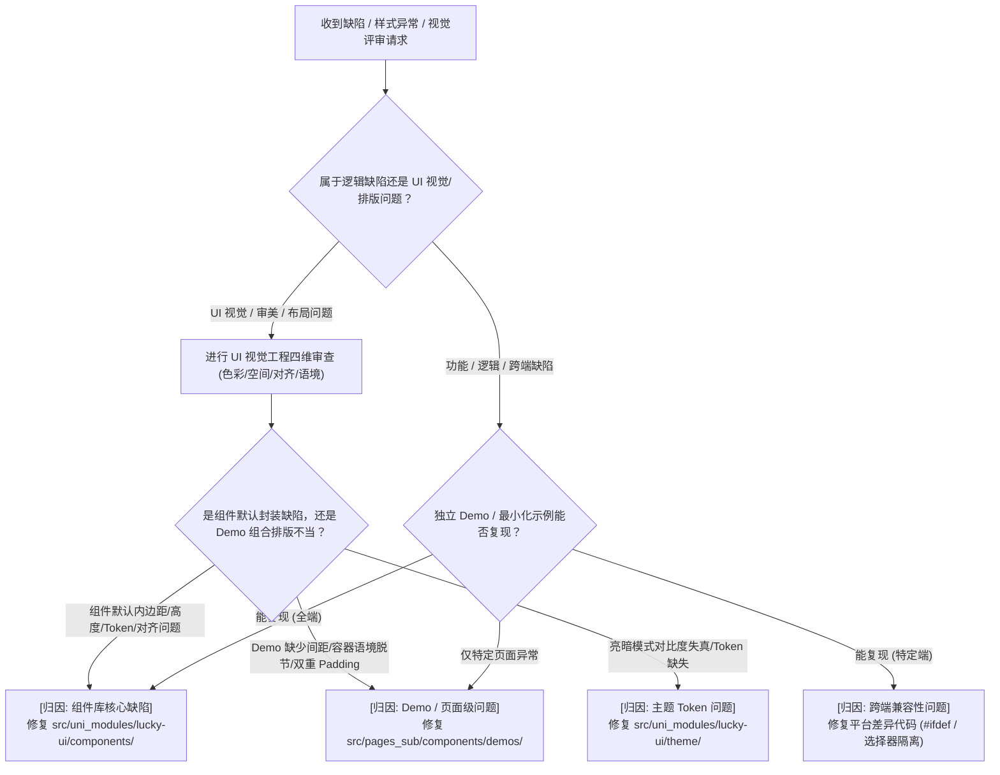

# Lucky UI 问题归因与 UI 视觉工程诊断指南

本技能落实 **Lucky UI Fix Diagnosis Rule** 与 **UI 视觉与模块化理性审查体系**。在进行组件 Review 或修复 UI 缺陷时，必须兼顾代码健壮性与视觉工程的理性判断，精准拆分元素位置与风格一致性。

---

## 一、 归因判定决策树

---

## 二、 UI 视觉工程与审美理性审查标准 (UI Review Criteria)

在对组件及其 Demo 进行 Review 或视觉验收时，必须依据以下 4 大专业维度逐项扫描，发现不合理直接明确指出：

### 1. 色彩层级与暗色模式对比度 (Color Hierarchy & Contrast)
* **容器底色统一性**：
  * 页面全局底色必须统一消费 `var(--lk-bg-page)`，Demo 卡片容器统一消费 `var(--lk-bg-container)`，输入性浅底容器消费 `var(--lk-bg-input)`。
  * **严禁** 在 Demo 内部私自写死 `padding: 30rpx; background: #...` 造成双重 Padding 或底色断层。
* **边框与暗色明度反差**：
  * Outline 描边变体在暗色模式下必须清晰可见，边框应绑定 `var(--lk-color-border)`，避免使用过弱的 `--lk-color-border-light` 导致 Outline 变体在深色背景下“隐形”。
  * 严禁出现 Filled 变体明度高于 Outline 变体导致的**视觉权重倒挂**。
* **文字语义阶梯**：
  * 正文：`var(--lk-text-primary)`（高强调）
  * 辅助说明 / 标签：`var(--lk-text-secondary)`（中强调）
  * 占位符 (Placeholder) 与弱图标：统一使用 `var(--lk-text-secondary)` 或 `var(--lk-text-placeholder)`，保持全库视觉一致
  * 禁用文本：`var(--lk-text-disabled)`

### 2. 空间节奏与呼吸感规范 (Spatial Rhythm & Breathing Room)
* **杜绝“堆叠紧贴”（Cramped Stacking）**：
  * Demo 页面中各个 `<demo-block>` 之间统一由容器控制 `margin-top: 32rpx`；
  * 同一卡片内的多个表单元素或按钮之间，**必须** 保持明确的呼吸间距（`margin-top: 24rpx` 或使用 `<lk-space :gap="24">`），严禁无间距挤压堆叠。
* **容器尺寸节奏平衡（Sizing Balance）**：
  * 避免在同一卡片内出现高度悬殊的极端对比（如 150px 巨框与 36px 细条并排）；
  * 多行输入组件默认应设置紧凑合理的 `min-height`（如 `120rpx`），避免无内容时大面积留白导致首屏折叠。
* **变体形态与真实容器语境（Contextual Alignment）**：
  * **Flush（无边框/下划线）变体** 专属于 Cell 列表行场景，严禁直接裸露丢在通用卡片白底/黑底中；必须放入带有标准内边距和背景的列表单元格容器（Cell Wrapper）中演示。

### 3. 微观对齐与光学平衡 (Micro Alignment & Optical Balance)
* **基线与中轴对齐（Baseline & Vertical Centering）**：
  * 多行文本首行与右侧清空按钮/后缀图标必须做行高补偿（如 `margin-top: 4rpx`），使图标中轴精准落在首行文字的字形中轴上，避免 2~3px 的悬浮偏差。
* **光学体积平衡（Optical Volume Balance）**：
  * 当几何封闭的实心图标（如 `x-circle`）与线条开放图标（如 `eye` / `search`）并排出现时，必须进行尺寸补偿（如实心用 `28rpx`，线条用 `32rpx`），消除视觉上的大号感与突兀感。

### 4. 交互反馈与状态解耦 (State Decoupling)
* **禁用态 (`is-disabled`)** 与 **只读态 (`is-readonly`)** 必须严格解耦：
  * 禁用态具有 `opacity: 0.6`、禁止手势和浅灰底；
  * 只读态保持内容清晰可读、支持选中复制，但聚焦时不产生主色光晕与高亮边框。

---

## 三、 归因分类与修改边界

| 归因类型 | 典型特征 | 修改目标目录 | 禁忌原则 |
| :--- | :--- | :--- | :--- |
| **组件库核心缺陷** | 默认高度失控、图标与首行基线未补偿、只读态缺少类名标记、Props/Events 失效 | `src/uni_modules/lucky-ui/components/` | 严禁编写只对某个特定业务场景生效的特化逻辑 |
| **Demo 页面问题** | 示例元素堆叠紧贴、缺少列表包裹容器、Demo 私加多重 Padding 或私有底色 | `src/pages_sub/components/demos/` | 严禁为了掩盖 Demo 布局问题往组件库根节点增加业务兜底 `!important` 样式 |
| **主题 Token 缺失** | CSS 变量未定义、暗黑模式边框对比度过低、颜色阶梯断裂 | `src/uni_modules/lucky-ui/theme/` | 不得在组件内硬编码十六进制颜色值 |
| **跨端兼容问题** | 小程序样式隔离导致选择器未穿透、原生组件遮挡、生命周期差异 | `src/uni_modules/lucky-ui/` 跨端兼容层 | 避免在 H5 端引入小程序特有 Polyfill 代码 |

---

## 四、 诊断输出格式要求

在进行 Review 或开始修复前，AI 必须在回复中按专业标准输出明确的归因与 UI 理性分析：

> **归因结论**：[组件库核心 / Demo 页面 / 主题 Token / 跨端兼容]
> **UI 理性审核判定**：
> 1. **色彩与对比度**：[分析暗色/亮色下的层级表现与边框清晰度]
> 2. **空间与节奏**：[分析元素间距是否紧贴、高度落差是否协调、容器语境是否匹配]
> 3. **微观对齐**：[分析图标、文字基线、内边距的光学对齐度]
> **整改动作**：[明确指出修改组件源码还是调整 Demo 页面]

