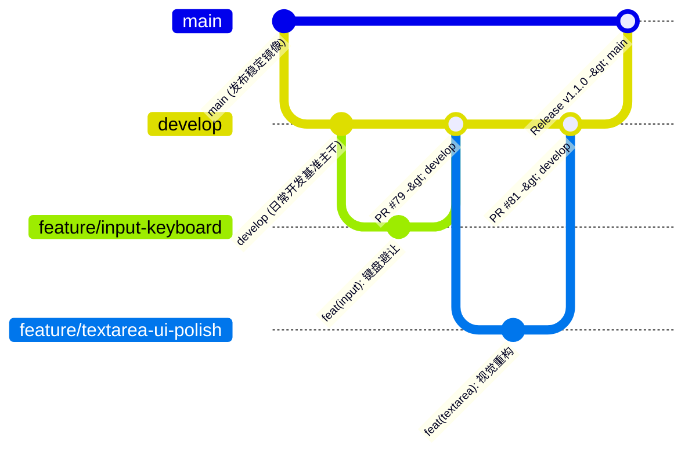
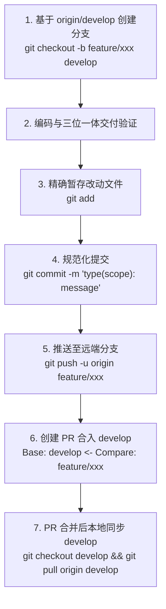

# Lucky UI Git 分支管理与 PR 操作规范 (Develop-Driven Workflow)

本技能规范了 Lucky UI 个人单人维护与多任务敏捷迭代中的 Git 分支生命周期、Commit 提交标准、多分支环境下的改动保护以及 Pull Request (PR) 流程，确保多任务并行开发时**基准统一、改动可追溯、本地预览不丢失**。

---

## 一、 分支架构与生命周期 (Develop 驱动模型)



### 1. 分支角色定位

| 分支 | 角色定位 | 操作规范 |
| :--- | :--- | :--- |
| **`develop`** | **日常核心基准主干 (Default Development Trunk)** | 所有日常开发、功能迭代、缺陷修复的基准分支与 PR 唯一合并目标分支 |
| **`main`** | **生产稳定发布镜像 (Release Mirror)** | 仅在发版（发布新版本 tag/npm 发布）时由 `develop` 集中合并进 `main`，平时不直接向 `main` 提日常 PR |
| **`feature/*`** | **功能迭代分支** | 基于最新的 `origin/develop` 检出，开发完成后向 `develop` 提 PR |
| **`fix/*`** | **缺陷修复分支** | 基于最新的 `origin/develop` 检出，修复验证完成后向 `develop` 提 PR |
| **`chore/*`** | **工程与工具链分支** | 工作流脚本、Agent 技能与配置维护，向 `develop` 提 PR |

---

## 二、 规范化提交格式 (Conventional Commits)

每次提交必须严格遵循以下结构：

```text
<type>(<scope>): <subject>

[可选的详细说明 body]
```

### 1. Type 类别
- `feat`: 新增组件或功能（如 `feat(textarea): 支持 auto-height 与字数统计`）
- `fix`: 修复组件缺陷或样式错位（如 `fix(textarea): 修复暗色模式边框对比度`）
- `docs`: 仅文档或示例修改（如 `docs(input): 补充弹窗键盘避让示例`）
- `style`: 代码格式或微观样式优化（不影响组件公共 API）
- `refactor`: 重构代码结构（无新增功能且无破坏性变更）
- `test`: 增加或更新单元测试
- `chore`: 工作流、Agent 技能、工具链或工程配置

### 2. Scope 作用域
使用具体组件名或模块名（小写）：`input`, `textarea`, `popup`, `button`, `theme`, `agents`, `docs`。

---

## 三、 本地预览与分支防丢失守则

### 1. 为什么本地预览会“丢失之前的改动”？
* **原因**：当从已合入 `develop` 的前序功能分支（如 `feature/input-popup-keyboard`）切换到基于旧基线创建的分支时，由于当前分支落后于 `origin/develop`，本地 Dev Server 编译出的预览包将不再包含输入框改动。
* **排查指令**：
  ```bash
  # 1. 查看当前处于哪个分支
  git branch --show-current
  
  # 2. 查看本地与远端 develop 的差异
  git log --oneline -n 5 origin/develop
  ```

### 2. 单人敏捷开发的标准流水线
1. **开始新任务前，先拉取最新的 `origin/develop`**：
   ```bash
   git checkout develop
   git pull origin develop
   ```
2. **基于最新的 `develop` 创建独立特性分支**：
   ```bash
   git checkout -b feature/textarea-ui-polish develop
   ```
3. **切换分支前必须确保工作区干净**：
   - 严禁带着未暂存（unstaged）的代码直接 `git checkout`，避免改动被带入无关分支或被意外覆盖。

---

## 四、 提交、推送与 PR 标准流水线



### 1. 精确暂存与提交
```bash
# 检查当前修改的文件
git status

# 逐个或按目录暂存，严禁盲目 git add . 提交临时文件
git add src/uni_modules/lucky-ui/components/lk-textarea/
git add src/pages_sub/components/demos/textarea-demo.vue
git add tests/unit/lk-textarea.spec.ts

# 规范化 Commit
git commit -m "feat(textarea): 优化暗色对比度、清除图标与排版间距"
```

### 2. 安全推送与准确 PR 链接生成
推送分支后，生成 PR 链接时**必须显式指定目标为 `develop`**（避免 GitHub 默认选中 `main`）：

```text
https://github.com/Orpheus-K/lucky-ui/compare/develop...<your-branch-name>?expand=1
```

### 3. PR 描述标准模版 (与历史 PR 统一)
创建 Pull Request 时，统一采用 Lucky UI 规范的 4 段式 Markdown 结构（参考 PR #80 范式）：

```markdown
### 背景
为 Lucky UI 的 lk-xxx 组件优化暗色模式下的视觉表现、统一清除图标与微观基线对齐，并重构 Demo 消除元素堆叠与间距塌陷。

### 变更内容
* **组件与样式优化 (lk-xxx)**
  * 将边框色绑定为 `--lk-color-border`，修复暗色模式下 Outline 变体隐形问题
  * 统一清除按钮为 `<lk-icon name="x-circle" size="28" />` 并增加 `margin-top: 4rpx` 首行基线补偿
  * 增加 `is-readonly` 类名，解耦禁用与只读态的焦点表现
* **Demo 交互与排版重构**
  * 拆分单卡片杂糅变体为独立卡片，规范各变体容器语境
  * 使用 `<lk-space>` 替换脆弱的选择器，确保 24rpx 稳定垂直间距
  * 清除 Demo 内部私有 Padding 与底色，统一全局 `--lk-bg-page`
* **技能与规范升级**
  * 升级 `lucky-ui-diagnose` 视觉工程四维审查标准
  * 完善 `lucky-ui-git` 为 Develop 驱动的敏捷流转规范

### 验证结果
* `tests/unit/lk-xxx.spec.ts` 单元测试全部通过
* H5 亮暗双色模式渲染正常
* 微信小程序真机排版间距正常，无样式穿透失效

### 验收说明
本 PR 聚焦于组件视觉与 Demo 排版体验优化，所有公共 Props/Events 保持 100% 向下兼容。
```

