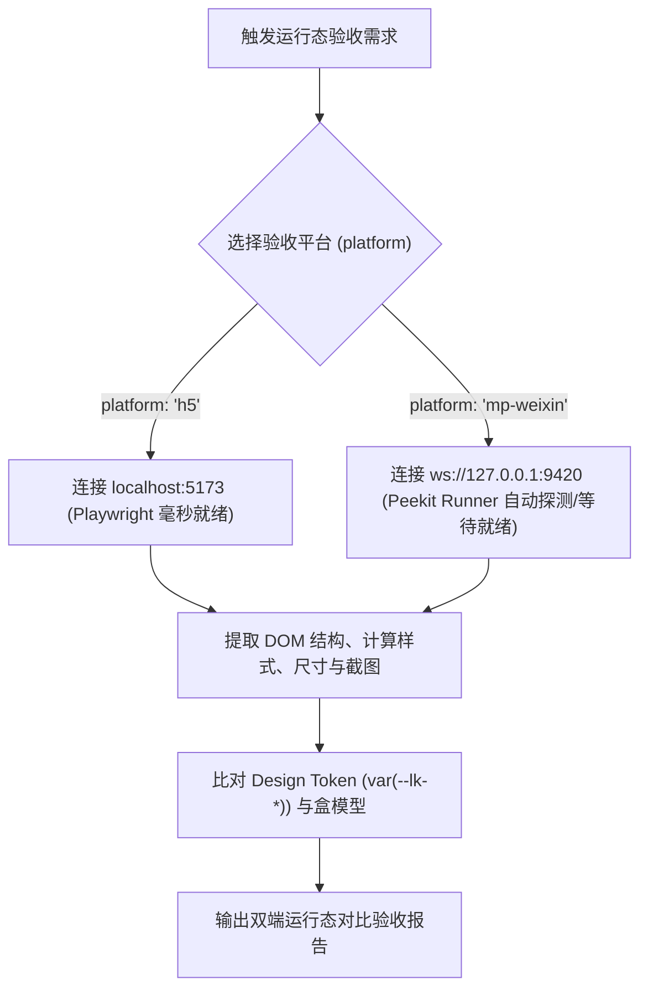

# Lucky UI 双端运行态视觉验收 (Peekit MCP)

本技能规范了通过 **Peekit MCP** 对 `lucky-ui` 在 **H5 预览端** 与 **微信小程序端 (`mp-weixin`)** 进行跨端运行态（DOM/WXML、Computed Style、元素尺寸与高清截屏）自动化走查的标准流程。

---

## 1. 核心特性与端能力对比

| 维度 | H5 运行态 | 微信小程序运行态 (`mp-weixin`) |
| :--- | :--- | :--- |
| **底层驱动** | Playwright (Chrome/Webkit) | `miniprogram-automator` (微信开发者工具 CLI) |
| **通信端口** | `http://localhost:5173` | `ws://127.0.0.1:9420` |
| **启动特性** | 秒级热启动 (毫秒级响应) | **冷启动较慢 (20~45 秒启动+编译+开端口)** |
| **结构产物** | HTML DOM 树 / `outerHTML` | WXML 树 / `outerWxml()` |
| **样式产物** | `window.getComputedStyle()` | `element.style(name)` / `page.getComputedStyle` |

---

## 2. 微信开发者工具慢启动防重试机制 (关键准则)

> [!WARNING]
> **微信开发者工具冷启动耗时通常在 20~45 秒之间**（拉起 NW.js 进程、校验项目、全量编译 WXML/JS 并开放 9420 自动化端口）。
>
> **严禁 Agent 行为**：
> 1. 严禁因端口前 20 秒未连接而判定为“失败”，严禁进入循环重试或反复拉起 CLI。
> 2. 必须依靠 Peekit MCP Runner 内置的 **单例锁与 60s 渐进轮询机制**，保持单次调用等待就绪。
> 3. 若触发 60s 超时，严禁死循环重试，必须提示开发者检查：
>    - 微信开发者工具 -> **设置 -> 安全设置 -> 开启【服务端口】**。
>    - 微信开发者工具是否正常登录且项目未被弹窗阻断。

---

## 3. 标准验收流水线



---

## 4. 双端调用示例与指令

### ① H5 页面运行态走查
```json
{
  "tool": "peekit_inspect_element",
  "args": {
    "platform": "h5",
    "url": "http://localhost:5173/#/pages/button/button",
    "selector": ".lk-button--primary"
  }
}
```

### ② 微信小程序运行态走查
```json
{
  "tool": "peekit_inspect_element",
  "args": {
    "platform": "mp-weixin",
    "route": "pages/button/button",
    "selector": ".lk-button--primary"
  }
}
```

---

## 5. 标准双端验收报告模版

```markdown
### 🔍 跨端运行态验收报告 (Peekit)
- **组件名称**：`lk-button` (路径: `pages/button/button`)
- **双端运行态对比**：
  | 指标 | H5 端 (Playwright) | 微信小程序端 (Automator) | 规范基准 (Token) | 判定 |
  | :--- | :--- | :--- | :--- | :--- |
  | **元素高度** | `44px` | `44px` | `--lk-button-height-md: 44px` | ✅ 一致 |
  | **背景色** | `rgb(41, 121, 255)` | `rgb(41, 121, 255)` | `--lk-primary: #2979ff` | ✅ 一致 |
  | **边距/Padding** | `0 16px` | `0 16px` | `--lk-padding-md: 16px` | ✅ 一致 |
  | **圆角** | `4px` | `4px` | `--lk-radius-sm: 4px` | ✅ 一致 |
- **视觉截屏**：H5 与 微信小程序文字垂直居中一致，无跨端选择器穿透失效。
- **结论**：✅ 双端运行态验收通过
```
